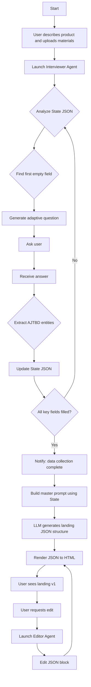

# PRD и Схема Работы: ИИ-Тильда на основе AJTBD

**Версия:** 2.0 (Гибкий пайплайн)
**Автор:** Manus AI

**Задача:** Описать продукт, который через естественный диалог собирает с пользователя информацию по методологии AJTBD, формирует на её основе промпт для генерации лендинга по структуре Вани Замесина и позволяет итеративно редактировать результат.

---

## 1. Ключевая идея и Ценность

Продукт — это не анкета, а **ИИ-маркетолог и интервьюер**. Он ведёт с пользователем («блондинкой») естественную беседу о его продукте, скрывая под капотом сложную методологию AJTBD. 

**Ценность для пользователя:** Получить продуманный с маркетинговой точки зрения лендинг, не разбираясь в маркетинге. Пользователь чувствует, что его слушает и понимает эксперт, а не бездушная форма.

---

## 2. Схема Работы (Workflow)



---

## 3. Product Requirements Document (PRD)

### 3.1. Пользовательский сценарий (User Flow)

1.  **Onboarding:** Пользователь заходит в сервис. Его встречает ИИ-помощник с сообщением: *«Привет! Я ваш личный маркетолог. Расскажите мне о вашем продукте, как другу. Можете даже загрузить любые тексты или презентации, которые у вас есть».*
2.  **Интервью:** Пользователь начинает рассказывать. ИИ задает ему уточняющие, открытые вопросы, ведя диалог. Пользователь не видит никаких анкет или списков. Для него это просто беседа.
3.  **Саммари:** Периодически ИИ может уточнять: *«Правильно ли я понял, что главная проблема ваших клиентов в том, что...»*.
4.  **Генерация:** После 5-10 минут диалога ИИ говорит: *«Отлично, у меня достаточно информации, чтобы собрать первую версию сайта! Минутку...»*. На экране появляется первая версия лендинга.
5.  **Редактирование:** Пользователь смотрит на сайт и пишет в чат: *«Супер, только давай поменяем заголовок на "Торты для самых любимых"»* или *«Сделай текст про доставку более подробным»*. Сайт на экране мгновенно обновляется.

### 3.2. Функциональные требования

#### 3.2.1. Агент-Интервьюер (Core)

-   **Задача:** Вести с пользователем естественный диалог для сбора AJTBD-сущностей.
-   **State (Состояние):** Внутри агента хранится JSON-объект, который является «внутренним PRD» для лендинга. Его структура повторяет мастер-промпт Вани (поля `core_job`, `big_job`, `trigger`, `barrier` и т.д., изначально `null`).
-   **Гибкий пайплайн:** Агент работает в цикле:
    1.  Найти самое важное незаполненное поле в State.
    2.  Сформулировать открытый, адаптивный вопрос, чтобы получить эту информацию.
    3.  Проанализировать ответ пользователя (включая текст из файлов).
    4.  Извлечь одну или несколько AJTBD-сущностей.
    5.  Заполнить соответствующие поля в State.
    6.  Повторить цикл.
-   **Обработка файлов:** Агент должен уметь анализировать загруженные `.txt`, `.md`, `.docx` файлы и извлекать из них информацию для заполнения State.

#### 3.2.2. Агент-Генератор

-   **Задача:** Создать первую версию лендинга.
-   **Триггер:** Запускается, когда Агент-Интервьюер заполнил все критически важные поля в State.
-   **Процесс:**
    1.  Берет заполненный State.
    2.  Формирует из него **мастер-промпт** по шаблону Вани Замесина.
    3.  Отправляет промпт в LLM с инструкцией сгенерировать не HTML, а **JSON-структуру лендинга**. Пример JSON:
        ```json
        {
          "oneliner": "Торты на заказ, которые дарят восторг и экономят ваше время.",
          "blocks": [
            { "type": "features", "title": "Как мы это делаем?", "items": [...] },
            { "type": "testimonials", "title": "Что говорят мамы?", "items": [...] }
          ]
        }
        ```
    4.  Сохраняет этот JSON как `landing_structure.json`.

#### 3.2.3. Рендерер (HTML)

-   **Задача:** Отобразить лендинг пользователю.
-   **Процесс:** Это простой компонент (не ИИ), который берет `landing_structure.json` и на его основе рендерит статичный HTML-сайт. Разделение на JSON и HTML — ключ к простому редактированию.

#### 3.2.4. Агент-Редактор

-   **Задача:** Вносить правки в лендинг по текстовым командам пользователя.
-   **Триггер:** Любое сообщение от пользователя после генерации первой версии лендинга.
-   **Процесс:**
    1.  Получает команду, например: *«Сделай заголовок более дерзким»*.
    2.  Читает `landing_structure.json`.
    3.  Определяет, какой блок и какое поле в JSON нужно изменить (например, `oneliner`).
    4.  Генерирует новое значение для этого поля.
    5.  Обновляет `landing_structure.json`.
    6.  Рендерер автоматически перерисовывает HTML на основе обновленного JSON.

### 3.3. Технический стек (рекомендация)

-   **Бэкенд:** Python.
-   **AI/Agents:** LangChain или DeepAgents для управления цепочками и состоянием агентов.
-   **Фронтенд:** Любой современный фреймворк (React, Vue), способный динамически рендерить HTML из JSON.

### 3.4. Нефункциональные требования

-   **Отзывчивость:** Редактирование лендинга должно ощущаться мгновенным. Обновление HTML после команды пользователя — не дольше 1-2 секунд.
-   **Простота:** Интерфейс должен состоять из одного окна чата и области предпросмотра сайта. Никаких лишних кнопок.
